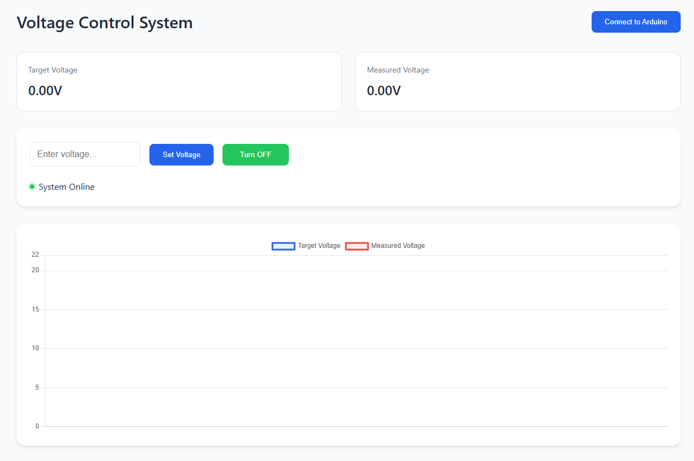

# Linear Voltage Regulator 24V

A web-based interface for controlling and monitoring an Arduino-based voltage regulation system. This project combines hardware control through an Arduino with a modern web interface for real-time voltage monitoring and control.



## Features

- Real-time voltage monitoring with interactive graph
- Digital control of output voltage (0-21.5V range)
- Power state control (ON/OFF)
- Responsive web interface with modern design
- Physical control support through rotary encoder
- LCD display for local monitoring
- Automatic voltage measurements and updates

## Hardware Requirements

- Arduino board with DAC capability (e.g., Due, Zero, or MKR family)
- 16x4 LCD Display
- Rotary Encoder with push button
- Voltage measurement circuit connected to A1
- Voltage output circuit connected to DAC0

### Pin Configuration

```
LCD Display:
- RS: Pin 12
- EN: Pin 11
- D4: Pin 8
- D5: Pin 7
- D6: Pin 6
- D7: Pin 5

Rotary Encoder:
- A: Pin 2
- B: Pin 3
- Push Button: Pin 4

Analog:
- Voltage Measurement: A1
- Voltage Output: DAC0
```

## Software Setup

1. **Arduino Setup**
   - Open the Arduino IDE
   - Load the provided Arduino code
   - Install the LiquidCrystal library if not already installed
   - Upload the code to your Arduino board

2. **Web Interface Setup**
   - Save the HTML file to your computer
   - Open the file in a Chrome-based browser (required for Web Serial API support)

## Usage

### Connecting to Arduino

1. Open the web interface in your browser
2. Click the "Connect to Arduino" button in the top right
3. Select your Arduino from the port selection dialog
4. Wait for the connection confirmation

### Controlling Voltage

**Via Web Interface:**
- Enter desired voltage (0-21.5V) in the input field
- Click "Set Voltage" to apply
- Use the power button to toggle output ON/OFF
- Monitor real-time measurements on the graph

**Via Physical Controls:**
- Turn the rotary encoder to adjust voltage
- Press the encoder button to toggle power ON/OFF
- View current settings on the LCD display

### Display Information

The interface shows:
- Target voltage setting
- Measured output voltage
- System power state
- Real-time voltage graph (30-second history)

## Technical Details

### Communication Protocol

The Arduino and web interface communicate via Serial at 9600 baud using JSON messages:

**From Arduino to Web:**
```json
{
    "target": 12.0,
    "measured": 11.98,
    "isOn": true
}
```

**From Web to Arduino:**
- Set Voltage: `SET:12.0\n`
- Toggle Power: `POWER:TOGGLE\n`

### Voltage Calculations

- Input voltage range: 0-21.5V
- DAC resolution: 10-bit (0-1023)
- Conversion formula: `value = (requestedVoltage / 6.6) * (1023.0/3.3)`

## Troubleshooting

1. **Connection Issues**
   - Ensure you're using a Chrome-based browser
   - Check that the correct COM port is selected
   - Verify Arduino is properly connected via USB
   - Reset the Arduino if connection fails

2. **Voltage Reading Issues**
   - Verify analog input connections
   - Check voltage divider ratio if used
   - Ensure proper voltage reference configuration

3. **Display Problems**
   - Check LCD pin connections
   - Verify LCD library installation
   - Ensure proper power supply to LCD

## Development

### Project Structure

```
arduino-voltage-control/
├── arduino/
│   └── voltage_control.ino
├── web/
│   └── index.html
└── README.md
```

### Future Improvements

- Add data logging capability
- Implement voltage presets
- Add configuration options for calibration
- Extend graph history options
- Add export functionality for measurements

## Safety Notes

- Always verify voltage settings before connecting sensitive equipment
- Do not exceed maximum voltage ratings of your hardware
- Implement proper isolation and protection circuits
- Monitor temperature of voltage regulation components

## License

This project is released under the MIT License. See LICENSE file for details.

## Contributing

Contributions are welcome! Please feel free to submit a Pull Request.

1. Fork the project
2. Create your feature branch
3. Commit your changes
4. Push to the branch
5. Open a Pull Request

## Support

For issues and questions, please open an issue on the project repository.
